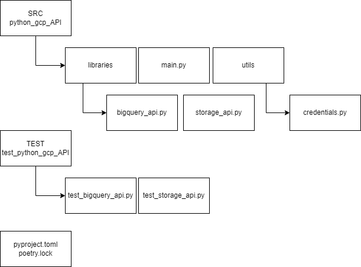

# Python GCP API Project

## Description
This project demonstrates how to interact with Google Cloud Platform services using Python, particularly BigQuery and Cloud Storage APIs. The project verifies the existence of a BigQuery table and a Cloud Storage bucket.

## Repo Architecture

## Prerequisites
- Python 3.10 or later
- [Poetry](https://python-poetry.org/docs/#installation)
- Google Cloud Project with BigQuery and Cloud Storage enabled
- Service Account credentials JSON file

## Usage
1. Clone the repository:
   bash
   git clone https://github.com/scrbn72/python_gcp_API.git

   cd python_gcp_API

2. Install dependencies using Poetry:
   bash
   poetry install

3. Set Google Application Credentials:
   bash
   export GOOGLE_APPLICATION_CREDENTIALS="path/to/your/credentials-file.json"

4. Run tests:
   bash
   poetry run pytest test/test_python_gcp_API

## Further Improvements
- Add more features such as creating or deleting tables/buckets.
- Include more comprehensive test cases.
